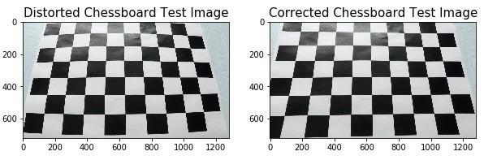
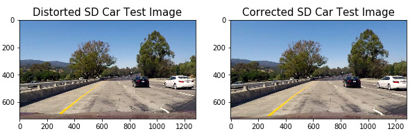
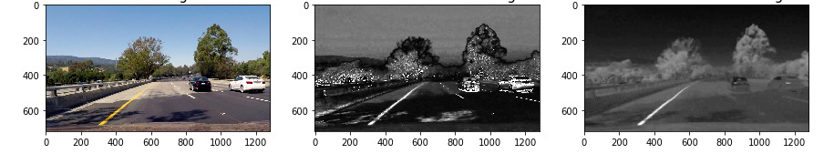
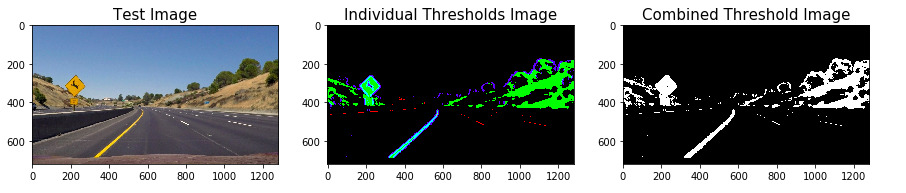
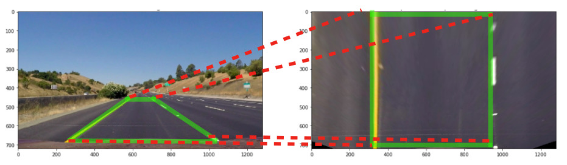
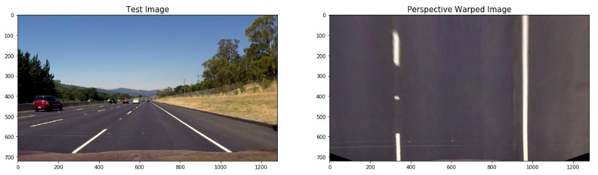
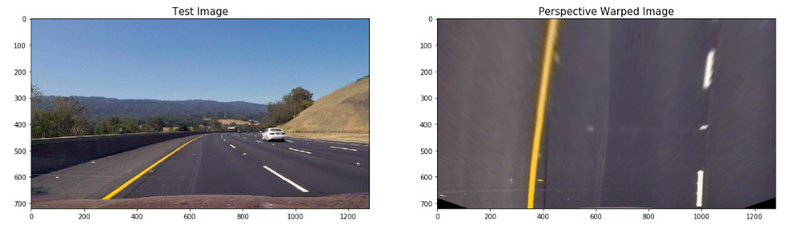
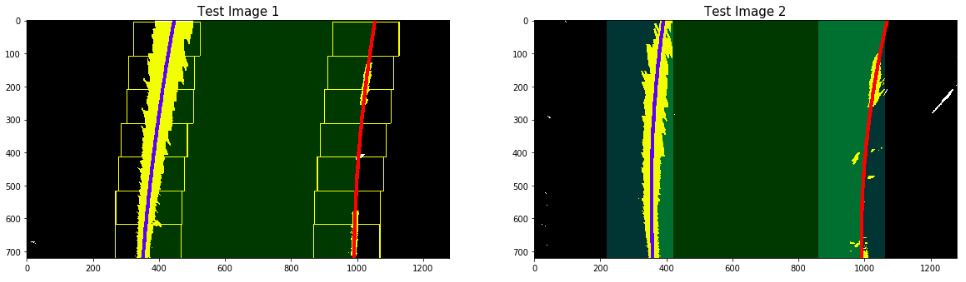
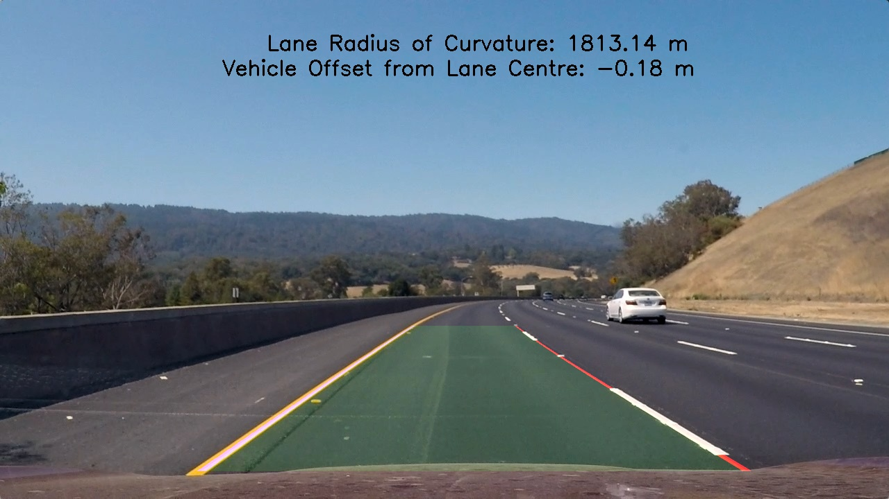

## Advanced Lane Finding 

---

**Writeup**

The goals / steps of this project are the following:

* Compute the camera calibration matrix and distortion coefficients given a set of chessboard images.
* Apply a distortion correction to raw images.
* Use color transforms, gradients, etc., to create a thresholded binary image.
* Apply a perspective transform to rectify binary image ("birds-eye view").
* Detect lane pixels and fit to find the lane boundary.
* Determine the curvature of the lane and vehicle position with respect to center.
* Warp the detected lane boundaries back onto the original image.
* Output visual display of the lane boundaries and numerical estimation of lane curvature and vehicle position.

## [Rubric Points](https://review.udacity.com/#!/rubrics/571/view)

### Here I will consider the rubric points individually and describe how I addressed each point in my implementation.  

Note: The code in this project works for the main project video and the first challenge video. Neither the algorithm, nor the parameters used, are meant for the harder challenge video, and hence it doesn't work well with the harder challenge video. A major change in approach is required for the harder challenge video and hence, it is not included here.

---

### Writeup / README

#### 1. Provide a Writeup / README that includes all the rubric points and how you addressed each one.  You can submit your writeup as markdown or pdf.  [Here](https://github.com/udacity/CarND-Advanced-Lane-Lines/blob/master/writeup_template.md) is a template writeup for this project you can use as a guide and a starting point.  

This is the writeup/readme file.

### Camera Calibration

#### 1. Briefly state how you computed the camera matrix and distortion coefficients. Provide an example of a distortion corrected calibration image.

The code for this step can be found in the 2nd and 3rd code cells of the [Jupyter notebook](./P2.ipynb) 

The camera matrix and distortion coefficients are calculated by mapping corners of the some 20 Chessboard images (taken with the same camera) to the real Chessboard object (assumed to be 2D(with z=0)) using `cv2.calibrateCamera()` function. The corner points on the chessboard image are detected automatically using `cv2.findChessboardCorners()` which gives as output `imgpoints`. This along with `objpoints` on from the real chessboard(given as an integer for each corner) is fed to the `cv2.calibrateCamera()` function.

The `cv2.calibrateCamera()` function returns the camera matrix and distortion coefficients of the camera. These coefficients are saved in a pickle file and then reloaded for future use. These coefficients are fed to the undistort function `cv2.undistort()` to undistort an image. The images below show the distortion correction applied to a test Chessboard image.

### Pipeline (single images)

#### 1. Provide an example of a distortion-corrected image.

The distortion correction is applied to images from the vehicle camera using the camera matrix and distortion coefficients obtained above. Here is a sample image from the vehicle corrected for distortion:

#### 2. Describe how (and identify where in your code) you used color transforms, gradients or other methods to create a thresholded binary image.  Provide an example of a binary image result.

The code for thresholding can be found in the 5th code cell of the [Jupyter notebook](./P2.ipynb) 

The thresholding was done based on the following 4 observations made during the trial phase:
1. The white lane lines were best identified using colour thresholding of the l channel of the hls colour space. But the threshold values are not consistent for different road types and brightness levels of the environment. 

    a. As a result, a dynamic thresholding based on the mode of the histogram of the 4 smaller regions of the road was used in this project. The 4 smaller regions are roughly the four quadrants on the road region(here the pixel values for these box boundaries are hard-coded and may not work for other image sizes). 
    
    b. These thresholds were tuned by trial and error manually only with data available from the project video and the first challenge videos. A default value of 200 is used as a backup for other pixel ranges. This value worked well for the project video, but failed with the challenge video. This forced me to think of a dynamic thresholding based on the actual road pixel values in the frame. These thresholds may fail in the harder challenge video and other scenarios. To avoid cases of underthresholding, if more than 5% or 10% of the pixels(based on size and location of the box) are captured, then the thresholding is discarded.

2. The yellow lane lines were best captured with the b channel of the lab colour space. It was better than the s channel of hls colour space, since the s channel also brought in lot of noise and unwanted pixels in shadow regions. This difference is shown below here (centre image is s-channel and right image is b-channel):

3. The yellow lane lines were not captured completely far away from the vehicle with just colour thresholding. As a result, x-gradient thresholding on the b-channel was also used to supplement the identification of the yellow lane lines. This gradient threshold is also scaled depending on the intensity of the pixels in the region of interest.

4. Thresholding based on gradients of the grayscale image or l or s channels of the image resulted in lots of noise and road defects being mistakenly captured as lane pixels. So, it was avoided.

A debug option was introduced to this function to display the 3 thresholding channels as different colours in a single image to help quickly identify problems. 

#### 3. Describe how (and identify where in your code) you performed a perspective transform and provide an example of a transformed image.

The code for perspective transform includes a function called `warp_birdseyeview()`, which can be found in the 6th code cell of the [Jupyter notebook](./P2.ipynb).  This function function takes as inputs an image (`img`), and gets the source (`src`) and destination (`dst`) points from a pickle file. The values in this pickle file are obtained from perspective transformation of an example straight lane line image (shown below):

This resulted in the following source and destination points:

| Source        | Destination   | 
|:-------------:|:-------------:| 
| 565, 470     | 0.25*src_img.shape[1], 0        | 
| 720, 470     | 0.75*src_img.shape[1], 720      |
| 1040, 680     | 0.75*src_img.shape[1], src_img.shape[0]      |
| 250, 680      | 0.25*src_img.shape[1], src_img.shape[0]        |

The verification of the perspective transform was done by checking with test images if the lane lines on the unwarped image appear parallel in the warped image. This is shown for two example images having straight lane lines and curved lane lines below:

**Straight lane lines**

**Curved lane lines**

Since these values are based on one example image, the warping function may not be robust and may provide poor results on roads with different slopes. But, it was found to be pretty robust on the project video. It did provide poorer warping on the challenge video, but it did not impact the final results.

#### 4. Describe how (and identify where in your code) you identified lane-line pixels and fit their positions with a polynomial?

The identification of lane-line pixels can be found in the 7th code cell of the [Jupyter notebook](./P2.ipynb)

This is done using the following functions and class:

1. A `fit_lane_pixels` function - which takes in the image, a tracking object and a debug mode as arguments. Setting the debug mode as True returns the visualization of the sliding windows, the selected windows, etc. to help in debugging. Setting this parameter as false returns an image with only the two lane lines, and a transparent green colour between them.
     This function checks the tracker object for a starting counter and forwards information to the `get_pixels_sliding window` function to get the lane pixels. If it is not a starting frame, then it forwards information to the `get_pixels_around_curve`function to get the lane pixels. It also checks confidence levels of the pixels obtained for each of the left and right lanes, and assigns coefficients from previous frames in case the confidence levels are low. It also checks for overshoots/deviations from previous values which indicates overfitting of the pixels and assigns coefficients from previous frames. In case of poor confidence from `get_pixels_around_curve` function or in the case of blackouts, where info on lane pixels is unreliable for more than 3 frames, it starts the sliding window search once again using the `get_pixels_sliding window` function. Once pixels with the minimum level of confidence are obtained it send the pixels to the tracker class to fit the curves. 
    
2. A `lane_lines_tracker` class - which maintains a history of the previous fitted coefficients, keeps a counter of frames, fits the current selected pixels to a 2deg polynomial, calculates exponential average to give a smooth output curve and also tracks blackout scenarious and also returns previous coefficients from history, wehn required.

3. A `get_pixels_sliding_window` function - which takes in the image, the tracker object and returns the selected lane pixels, the confidence levels and the image of the sliding windows(which may be required in debug mode) and returns the identified lane pixels. 7 sliding windows are used in this project. The starting points for the sliding windows are identified using the histogram peaks of the bottom left and right quadrants of the image. The sliding distances are obtained by convolving the windows with a template of 70 pixels width using the `np.convolve` function. The argmax values are used for calculating the sliding windows, while the max values are used as confidence level for each window. The final confidence lane level is calculated by checking how many windows meet the individual criteria and whether there are contributions from both top and bottom half of the image. Getting pixels in only one half of the image, resulted in frequent overfitting and wobbly lines veering off the path. This check controlled this behaviour.

4. A `get_pixels_around_curve` function - which takes in the image, the tracker object and the lane coefficients of the previous frame and returns the identified lane pixels. This function is more efficient than the sliding windows function since it search only in a margin around the previous fitted curve. The confidence level here is measured by checking how much proportion of the nonzero/hot pixels are selected by this margin. If it is below a certain level or if the pixels are not found in either top or bottom halves of the image, this information is sent to the calling `fit_lane_pixels` function. The `fit_lane_pixels` in this case, calls the `get_pixels_sliding_window` function once again.

5. A `plot_lanes` function - which takes in a 3 channel binary image and the fitted coefficients and returns an image with the lane lines plotted.

A couple of examples of the fitted lane lines, one each with the sliding windows function and with the curve margin function are shown below:

#### 5. Describe how (and identify where in your code) you calculated the radius of curvature of the lane and the position of the vehicle with respect to center.

The code for the calculation of the radius of the curvature and position of the vehicle with respect to the centre can be found in the 8th code cell in the function `calc_pos_curvature` of the [Jupyter notebook](./P2.ipynb). This function takes in the pixel y data and x data of both the curves which are in pixel scale, converts it to the real world scale using a guideline value of 30 meters per 'birds eyeview lane length' or 720 pixels in y dimension and 3.7 meters per 'birds eyeview lane width' or 640 pixels in x dimension (based on information given in the exercises). Once the scale conversion is done, the curve points are fitted once again to get the coefficients in the real world scale.

These coefficients in the real world scale are then used to calculate the radius of curvature.(This formula and the derivation can be found [here](https://www.intmath.com/applications-differentiation/8-radius-curvature.php))

The position of the vehicle with respect to the centre of the lane is calculated by finding out the bottom most lane points on the fitted curves, then finding the centre of the lane by taking their average and then calculating how far away the lane centre is away from the image centre. The image centre can be safely assumed to be the centre of the vehicle. The difference between the image centre and the lane centre is the position of the vehicle with respect to the lane centre.

#### 6. Provide an example image of your result plotted back down onto the road such that the lane area is identified clearly.

The plotting of the fitted curves back onto the road image can be found in `annotate_lane_output` function in the 9th code cell of the [Jupyter notebook](./P2.ipynb). This is done by overlaying the fitted curves image onto the original image using the `cv2.addWeighted()` function. This also displays the radius of curvature and position of the vehicle with respect to the lane centre. 

Here is one sample image of the annotated results:

---

### Pipeline (video)

#### 1. Provide a link to your final video output.  Your pipeline should perform reasonably well on the entire project video (wobbly lines are ok but no catastrophic failures that would cause the car to drive off the road!).

Here's the [link to my project video result](./output_videos/output_project_video.mp4) for the main project video. 
And, here's the [link to my challenge video result](./output_videos/output_challenge1_video.mp4)

---

### Discussion

#### 1. Briefly discuss any problems / issues you faced in your implementation of this project.  Where will your pipeline likely fail?  What could you do to make it more robust?

There were issues mainly in the following 3 aspects:

1. Perspective transforms for different road scenarios

    The perspective transform was hard coded with src and dst points from a single sample source image. This worked fine on the project video where the road was level, but did not give parallel lines/curves on the challenge videos. This was due to **different road scenarios where the roads sloped up or down**. To address this issue, I think the **transform needs to be done on a frame to frame basis, by identifying straight lines and the vanishing points** on the road lanes. In this way, a robust perspective transform can be obtained.

2. Colour and gradient thresholding of lane lines

    I decided to work on the first challenge video and realized that the colour and gradient thresholding that had worked so perfectly in the project video failed with both the challenge videos. So, I decided to use dynamic thresholding based on actual pixel values of the road in each frame. Also, roads with different colours on the same lane due to defects, made me do the thresholding based on 4 smaller quadrants on the road.

    By using only colour thresholding and not gradient thresholding for the white lines, the defects on the road could be avoided. It came with its own set of problems since in many cases, the white lines could not be identified completely with colour thresholding.

    Although this helped the pipeline succeed in the project as well as the first challenge video, it fails with the harder challenge video, **with extremely bright spaces, glare on the roads, heavy shadows, vehicles on the road and glare/reflections on the windshield.** Also, the pipeline will fail in case of the roads being too curved with hairpin bends, since the lane lines will be at abnormal postions on the image and the regional thresholds may fail to work in this sceanrio.

    The best option here would be to use Deep Learning models using Convolutional Neural Networks and segment the road lane pixels.

3. Fitting of lane lines 

    Fitting of lane lines was relatively easy with the project video, but in the challenge video, there were many instances where the thresholding failed - for example, under low lighting conditions under bridges or at a distance away from the vehicle where the lane pixels detected are very few or none. The main challenges in fitting lane lines are:
    
    a. **Overfitting of 2d curve** when pixels are concentrated around a few regions. For example, dotted/dashed lane lines or continuous lane lines that can only be seen half the distance. There were many instances where the pixels were concentrated around 2 points or on top/bottom half of the image and resulted in overfitted curves, that bent and flexed through the points instead of directly connecting them. (Remember, a second order curve needs a minimum of 3 well spaced points to have a decent fit). Such overfitted curves were detected and replaced with exponential smoothed curves. But still in some cases, wobbly curves were seen in the challenge video. This can be solved either by improving the thresholding stage or by using a better overfit/overshoot detection cum smoothing algorithm.
    
    b. **Blackouts** Blackouts are those frames in which we completely lose track of both the lane lines. In such situations, deciding when and how long to use the curves from past frames, till reasonable amount of pixels are detected is a challenge. 
    
    c.  **Rejecting falsely identified pixels** from objects/defects other than lane lines. There are many pixels which belong not to the lane lines, but to defects on the road, nearby vehicles, sign boards, grass, plants, sidewalks, etc. Using Deep Learning based models here would greatly help.
    
    d. **Curvy roads with hairpin bends** can also cause significant problems, since the lane lines will be at abnormal postions on the image and the existing sliding windows algorithm or margins around curves may not be sufficient to identify the lane pixels.